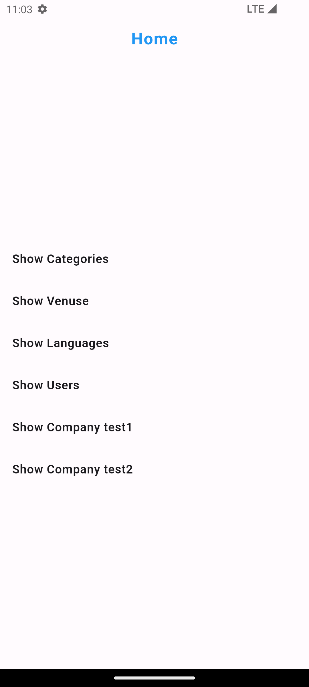
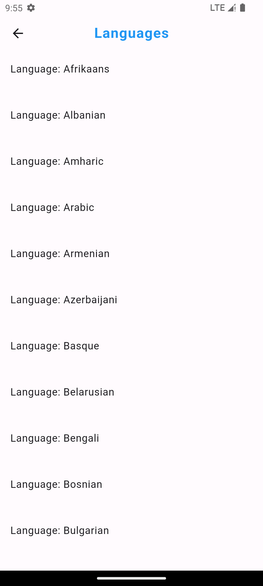

# [PTC at ITE](https://www.facebook.com/placement.training.center.ITE)

# Modeling In Dart

- [✨ Features](#-features)
- [📱 App Preview](#-app-preview)
- [📂 Main Files](#-main-files)
- [🚀 Usage](#-usage)
- [⚙️ Installation](#-installation)
- [🤝 Contributing](#-contributing)
- [📄 License](#-license)

## ✨ Features

- **Singleton Pattern**: Ensures a class has only one instance and provides a global point of access
  to it.
- **Lazy Loading**: Delays the initialization of an object until it is needed, improving performance
  and reducing memory usage.
- **Caching Data**: Stores frequently accessed data in memory for quick retrieval.
- **Freezed Package**: Simplifies creating immutable classes and union types.
- **JsonSerializable Package**: Provides easy conversion between Dart objects and JSON data.

## 📱 App Preview

<div style="display: flex; flex-wrap: wrap; gap: 50px;">







</div>

## 📂 Main Files

Here are the links to the main files in the project:

- [extensions](lib/core/extensions)
- [main.dart](lib/main.dart)
- [app.dart](lib/view/app/my_app.dart)
- ### Categories
    1. [Categories screen](lib/view/categories/categories_screen.dart)
    2. [Categories data](lib/question2/data/categories.dart)

### Venues

    1. [Venues screen](lib/view/venuse/venuse_screen.dart)

    2. [Venues data](lib/question2/data/venues.dart)

- [Models](lib/question1/models)
    - Data models created using `freezed` and `json_serializable`.
- ### User
    1. [User Model](lib/question3/models/user/user_model.dart)
    2. [Users Data](lib/question3/data/users.dart)
    3. [Users Cache](lib/question3/user_cache.dart)

## 🚀 Usage

To leverage the features in this app:

- **Singleton Pattern**: Use the singleton pattern to manage your instances.
- **Lazy Loading**: Ensure objects are only created when they are needed.
- **Caching Data**: Utilize the caching mechanism to store and retrieve frequently accessed data
  efficiently.
- **Freezed**: Create immutable data classes easily using `freezed`.
- **JsonSerializable**: Automatically convert between Dart objects and JSON
  using `json_serializable`.

## ⚙️ Installation

1. **Clone the repository**:
    ```bash
    git clone https://github.com/Ahmad-Nour-Haidar/ptc-modeling-in-dart.git
    ```

2. **Navigate to the project directory**:
    ```bash
    cd ptc-modeling-in-dart
    ```

3. **Install dependencies**:
    ```bash
    flutter pub get
    ```

4. **Run the application**:
    ```bash
    flutter run
    ```

## 🤝 Contributing

We welcome contributions to enhance the Pharmageddon app. Here’s how you can help:

1. **Fork the repository**.
2. **Create a new branch**:
    ```bash
    git checkout -b feature-branch
    ```
3. **Make your changes and commit them**:
    ```bash
    git commit -m "Description of the feature"
    ```
4. **Push to the branch**:
    ```bash
    git push origin feature-branch
    ```
5. **Create a pull request**.

Please ensure your pull request adheres to the following guidelines:

- Describe the feature or fix in detail.
- Ensure the code follows the existing style and conventions.
- Include screenshots or demos of the new feature or fix if applicable.

## 📄 License

This project is licensed under the MIT License. See the [LICENSE](LICENSE) file for details.
